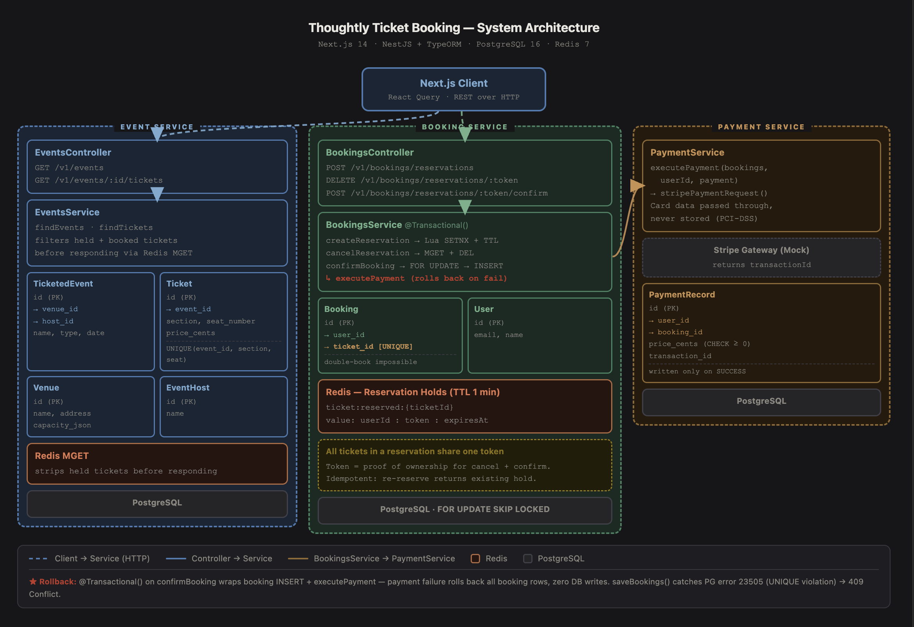

# Thoughtly Ticket Booking System

An end-to-end concert ticket booking system built with Next.js (frontend), NestJS + TypeORM (backend), and PostgreSQL.

[Link to unlisted YouTube Demo Video](https://youtu.be/5FmNNWznINw)



---

> **⚠️ Post-submission fix — concurrency bug in `confirmBooking`**
>
> After submitting, I noticed a small error where I had designed the booking system to use `FOR UPDATE SKIP LOCKED` on retrieving tickets before booking so that we would always skip mid-confirmation locks. The skip had been documented in the README, referenced in code comments, and had been the intention. Upon further review I realized I had mistakenly not applied it, the code used plain `SELECT FOR UPDATE` (`pessimistic_write`), causing concurrent confirms to queue and wait rather than fail fast. This caused all concurrent confirms on the same ticket to **queue and wait** behind the lock rather than fail fast, which under high concurrency leads to connection pool exhaustion and cascading timeouts.
>
> As I investigated the correct fix, I realized that `SKIP LOCKED` itself would not have been the right solution either. Letting the database fail on a unique constraint is much more efficient and scalable than `SKIP LOCKED`. If N requests try to write, only one wins and the rest get a rejection. This is a very fast way to fail because, from what I researched, the rejection is executed entirely in high-speed RAM using B-tree index lookups. The losers block at the INSERT until the winner commits, then receive a Unique Violation and never reach Stripe. Meanwhile, `SKIP LOCKED` and `NOT EXISTS` make reads in an already highly contentious system all the more complex. There is also a correctness failure: if Transaction A's payment fails and rolls back, `SKIP LOCKED` has already rejected Transaction B with a 409 — a perfectly valid checkout lost for a seat that remained available. Relying on the unique constraint is the best way to optimize for maximum concurrency and throughput. While `SKIP LOCKED` and `NOT EXISTS` allow for a fail-fast system which on its face appears better, but after some scrutiny it is worse. By failing fast and preemptively rejecting certain users, you are at scale forcing more restarts and not moving them through the system, which reduces throughput.
>
> **The fix:** I removed `SKIP LOCKED` entirely and the `NOT EXISTS` check, making the request as lightweight as possible and relying entirely on the `UNIQUE` constraint on `booking.ticket_id`. If two confirms race past the Redis check simultaneously, exactly one insert commits and the other receives a Unique Violation returned as a 409. I also updated the README and other code references to reflect this. See `bookings.service.ts` Step 2 for the full comment.
>
> Furthermore, all this research has made me reconsider my approach around storing tickets as an entity, but that can be a discussion for later.

---

## Running with Docker (recommended — nothing else required)

The only requirement is [Docker Desktop](https://www.docker.com/products/docker-desktop/). No Node, no Postgres, no Redis needed on your machine.

NOTE: the docker compose runs all migrations and we have a SEED data migration that populates DB with relevant records to allow the app to be usable from the get go. In a real production environment we wouldn't seed the DB via a data migration like this.

```bash
docker compose up --build
```

This will:

1. Start Postgres and Redis
2. Install all dependencies
3. Run all database migrations
4. Start the backend and frontend

| Service  | URL                      |
| -------- | ------------------------ |
| Frontend | http://localhost:3000    |
| Backend  | http://localhost:4000/v1 |

To stop everything:

```bash
docker compose down
```

To stop and wipe the database (start fresh on next `up`):

```bash
docker compose down --volumes
```

---

## Running locally (manual setup)

### Prerequisites

- Node.js >= 22
- pnpm: `corepack enable && corepack prepare pnpm@latest --activate`
- PostgreSQL running on `localhost:5432`
- Redis running on `localhost:6379`

### Install

```bash
pnpm install
```

### Run the backend

```bash
pnpm dev:backend
```

API runs at `http://localhost:4000`. DB connection defaults: host `localhost`, port `5432`, user `postgres`, password `postgres`, database `ticket_booking`.

### Run the frontend

```bash
pnpm dev:frontend
```

UI runs at `http://localhost:3000`.

## Migrations

Run from `apps/backend/` or prefix any command with `pnpm --filter backend`. Migration files live in `apps/backend/migrations/`.

```bash
# Apply all pending migrations (schema + data)
pnpm migration:run

# Roll back the last migration
pnpm migration:revert

# Show migration status
pnpm migration:show
```

---

## Testing

### What we test

Tests run against real Postgres and real Redis via a docker-compose.test

The seed data migration does a lot of heavy lifting here: it populates users, events, venues, and a full ticket inventory before any test runs.
Normally tests should have their own dedicated seeding system. We wouldn't seed the database for tests via a migration — there would be a separate seeding process.

### How to run

The only prerequisite is [Docker Desktop](https://www.docker.com/products/docker-desktop/). The script starts isolated test containers (Postgres on 5433, Redis on 6380), runs the full suite, then tears down everything — including on failure.

```bash
pnpm test:e2e:docker
```

If you already have the test containers running from a previous session, you can skip the Docker management and run Jest directly:

```bash
docker compose -f docker-compose.test.yml up -d
pnpm test:e2e
```

---

## Data Model Design

### Core trade-off: explicit tickets vs. inferred availability

A key design decision in this system is that every physical seat gets its own `ticket` row at event creation time, rather than deriving availability by subtracting bookings from a venue's stated capacity.

**The alternative** would be lighter on storage: store only the venue capacity and the set of bookings, then infer how many seats remain. Many systems work this way. We aren't doing that because availability-by-inference shifts the correctness burden onto application code. You need a reliable counter, you need to guard against race conditions on that counter, and "is this seat available?" becomes a computed answer rather than a database fact.

**What explicit tickets buy us:**

- **Database-level double-booking prevention.** The `UNIQUE` constraint on `booking.ticket_id` makes two bookings for the same seat physically impossible — the database enforces it, not our code. There is no counter to decrement incorrectly, no race on a shared integer.
- **Auditability.** Every ticket has a stable identity from the moment the event is created. Its full lifecycle — available → held → booked — is traceable as concrete state changes on a concrete row, not inferred from the absence or presence of other rows.
- **Simpler concurrency.** Concurrent confirms on the same ticket never queue — there is no lock. The `UNIQUE` constraint on `booking.ticket_id` is the hard guarantee: if two transactions both race past the Redis check and attempt an insert, exactly one commits and the other receives a Unique violation as a 409. No lock, no queue, no contention on the hot path.
- **Correctness that survives partial failures.** If a confirm rolls back mid-flight, the ticket row is still there, still in its pre-booking state. Nothing to revert, no counter to repair.

**The cost** is storage. At scale — thousands of events, large venues — this is hundreds of millions (if not Billions) of rows over time. We accepted this because tickets are written once at event creation and infrequently updated. The write cost is paid upfront and infrequently. At true scale, range partitioning on `event_id` would keep individual partition sizes bounded without changing the query model at all. And critically, once an event is over its tickets are never queried again — they have no role in the live booking flow. This makes archival straightforward: past-event partitions can be detached from the live database and moved to cold storage, leaving the live database dealing only with current and upcoming events. The row count that actually matters to query performance is therefore bounded by the number of active events at any given time, not the total historical volume.

The summary: we traded storage for correctness, storage is cheap, and the data that accumulates over time naturally segregates into a form that is trivial to archive.

### Double booking prevention

Availability is inferred by whether a `booking` row references a ticket. The `UNIQUE` constraint on `booking.ticket_id` is the hard database-level guarantee: two bookings for the same ticket are physically impossible. The confirm path inserts directly with no row-level lock. If two confirms race past the Redis check simultaneously, exactly one insert commits; the other hits the `UNIQUE` constraint.

### Payment records

`payment_record` rows are written only on payment success — one row per ticket in the booking. There is no FAILED status. If payment fails, the surrounding `@Transactional()` rolls back the entire operation: the booking rows never commit and no payment record is written. The database is left completely clean, as if the confirm attempt never happened. This means the presence of a `payment_record` is itself the signal that a booking completed — no status column needed.

Each record stores `user_id`, `booking_id`, `price_cents` (the total charge across all tickets in that batch), and the processor-returned `transaction_id`. Raw card details (number, CVV, expiry, postal code) are passed through to the payment processor but never persisted — PCI-DSS compliance.

## Backend Service Structure

NestJS is an opinionated framework built around modules, so here just following that convention. Each feature is a self-contained module with its own controller, service, DTOs, and entities co-located together

```
src/
  events/          # TicketedEvent, Ticket entities + GET /v1/events routes
    dto/           # API response shapes owned by this module
    entities/
      ticketed-event.entity.ts
      ticket.entity.ts
  bookings/        # Booking entity + POST /v1/bookings routes + PaymentService
    dto/
    entities/
      booking.entity.ts
  payments/        # PaymentRecord entity — own module; in production would own payment history routes too
    entities/
      payment-record.entity.ts
  venues/          # Venue entity + VenueDto (imported by events)
    dto/
    entities/
      venue.entity.ts
  users/           # User entity (imported by bookings)
    entities/
      user.entity.ts
  hosts/           # EventHost entity + EventHostDto (imported by events)
    dto/
    entities/
      event-host.entity.ts
  common/          # Shared infrastructure — not a feature module
    db/            # DataSource, pagination utils, entity mixins
    redis/         # RedisModule + RedisService — consumed by events and bookings
```

### Event Reservation Holds Flow

The booking flow is split into three coordinated stages, all held together by a Redis TTL reservation system.

**1. Reading available tickets**

When a user opens an event page, `GET /v1/events/:id/tickets` returns only tickets that are neither booked nor currently held. The query excludes permanently booked tickets at the database level with a `NOT EXISTS (SELECT 1 FROM booking WHERE ticket_id = ticket.id)` subquery. Then, in a single Redis `MGET` call across all returned rows, any ticket whose key exists in Redis (i.e. is currently reserved by someone) is filtered out before the response is sent. The result is a list of tickets that are genuinely available right now.

**Multi-ticket selection and seat grouping.** Users select a quantity (1–8). The backend receives `?quantity=N` and returns tickets pre-grouped into runs of exactly `quantity` consecutive same-section adjacent-seat tickets. Each ticket in the response carries a `groupId` (1-based, resets per page) so the frontend can render seat groups without any additional logic.

**2. Reserving a ticket — the Redis hold**

When a user clicks Book, a `POST /v1/bookings/reservations` request runs an atomic Lua script against Redis that performs an all-or-nothing `SETNX` across all requested ticket keys. Each key is set with a TTL equal to the global hold window (1 minute). The stored value encodes `userId:reservationToken:expiresAt` in a single string — no secondary lookups needed.

**All tickets in a single reservation share the same `reservationToken`.** Each ticket gets its own Redis key (`ticket:reserved:{ticketId}`), but the value written under every key is identical. This means the token alone is sufficient to verify ownership across the entire group — cancel and confirm both use it as the single proof of ownership rather than checking each ticket independently. It also means a multi-ticket booking is cancelled atomically: one token covers all keys.

The hold is immutable once created. The `expiresAt` timestamp is embedded in the Redis value at write time and is never reset. If the same user retries the same reservation (e.g. due to a network error or React StrictMode double-fire), the Lua script detects the conflict and returns the existing value, including the original `expiresAt`. The caller receives the same token and expiry they would have gotten on first write. This means the hold cannot be extended by re-requesting it — the timer started when the key was first set and counts down regardless.

**3. Confirming the booking — closing the hold**

When the user submits payment, `POST /v1/bookings/reservations/:token/confirm` validates that every Redis key still exists and belongs to this user and token. If any key has expired or belongs to a different user, the request is rejected. Once ownership is confirmed, the backend queries the tickets and inserts directly with no lock — correctness under concurrent confirms is enforced entirely by the `UNIQUE` constraint on `booking.ticket_id`. Locking would cause concurrent requests to queue rather than proceed independently, risking connection pool exhaustion at high concurrency.

The confirm handler is wrapped in `@Transactional()`. Inside that transaction:

1. **Booking rows are inserted first** — one row per ticket, before any payment attempt.
2. **Payment is charged** — the total price across all tickets is sent to the processor as a single charge. All payment fields (card number, expiry, CVV, postal code) are passed through to the processor end-to-end but never stored.
3. **On success** — one `payment_record` row is written per booking, referencing the processor's transaction ID. The transaction commits. The tickets are now permanently booked.
4. **On failure** — the processor throws, the transaction rolls back, and the booking rows inserted in step 1 are discarded. No `payment_record` is written. The database is left exactly as it was before the confirm attempt.

Whether the payment succeeds or fails, the Redis keys are deleted in a `finally` block — the hold is always released, so the user does not stay locked out of re-trying.

After a successful confirm, the ticket disappears from both systems: the `NOT EXISTS` subquery excludes it from future `GET /tickets` responses, and the Redis key is gone. The ticket is no longer visible to anyone.

---

## Non-Functional Requirements

### Availability — 99.99% (four nines)

Ticket booking sits in an unusual position in the CAP theorem: most systems can accept a trade-off between consistency and availability, but here we need both at the same time. A double-booking is a correctness failure with real consequences. A crash during a high-demand on-sale is also a big failure. The design layers these guarantees independently so neither one undercuts the other.

**Consistency is enforced at the database level, not the application level.** The `UNIQUE` constraint on `booking.ticket_id` is the hard floor — two bookings for the same seat are physically impossible regardless of what happens at the application layer. The confirm path uses no row-level lock: concurrent confirms on the same ticket race to insert, exactly one commits, and the other hits `PG 23505` which is caught and returned as a 409. No lock means no queue and no connection pool exhaustion under high concurrency. `@Transactional()` ensures a payment failure cannot leave partial state in the database. These guarantees hold regardless of how many application servers are running.

**Availability is achieved through a distributed cache layer and a virtual waiting queue.**

Redis is the primary tool for availability. Reservation holds are written to Redis — not to the database — so the hot read path (`GET /tickets`) never touches Postgres under load. The Redis key has three properties that make it safe to use as a consistency boundary:

- **Immutable TTL.** The expiry is embedded in the value at write time and is never reset. A user cannot extend their hold by re-requesting it. The 1-minute clock starts at the moment the key is first written and counts down unconditionally.
- **Creator-only access.** The stored value encodes `userId:token:expiresAt`. Cancel and confirm both verify that the `userId` in the request matches the `userId` in the stored value before taking any action. A leaked token is not sufficient — you also need to be the user who created the hold.
- **Idempotent reserve.** If a client fires the same reserve request twice (lost response, React StrictMode double-fire, network retry), the Lua SETNX script detects the existing key and returns the stored value unchanged — same token, same expiry. The client reaches the same state as a first call. There is no way to create two holds for the same ticket under the same user.

**The virtual waiting queue is the final availability guarantee.** No matter how aggressively we scale horizontally or vertically, a large enough surge can exhaust capacity. With a queue, users are admitted in order at a rate the system can sustain. The queue is position-stable: users see their place and are admitted fairly, with no overloading the database. The queue decouples the user-facing experience (responsive, never crashed) from the backend throughput (bounded, correct). Together with the Redis TTL hold, the queue is also what makes the concurrency model work at scale: only users who have already been admitted and received a valid reservation token can issue a confirm request. The database never sees speculative load.

**For true multi-region 99.99%**, the infrastructure changes but the application model does not:

- **Use Redis Global Datastore.** Reservation writes go to the local primary; reads are served from the nearest replica. TTL expiry is synchronised globally. Lua scripts run on the primary and replicate atomically. One optimisation we have not yet applied: currently the raw Lua script is sent over the wire on every `EVAL` call. In production this should be replaced with `SCRIPT LOAD` at startup (which registers the script on the server and returns a SHA1 digest) followed by `EVALSHA` on every subsequent call — the wire payload drops from the full script body to a 40-character hash, which matters at high call rates.
- **PostgreSQL → CockroachDB (or Aurora Global Database).** CockroachDB is a distributed SQL database that speaks the PostgreSQL wire protocol. Aurora Global Database is the AWS-managed alternative if the team prefers staying closer to RDS.

  **Trade-offs vs. staying on PostgreSQL:**

  _Staying on PostgreSQL_ is the right call for most deployments. It is the most battle-tested transactional database available, with deep support, predictable locking behaviour, and no operational surprises. A single well-tuned Postgres primary with read replicas handles enormous write throughput — the confirm path is a single-row insert on an indexed table, and Postgres can sustain tens of thousands of such inserts per second on modest hardware. The cost of staying is that the primary is a single node: if it goes down, writes are unavailable until failover completes (typically 30–60s for managed Postgres like RDS). That failover window is the main availability risk.

  _CockroachDB_ removes the single-node write bottleneck by distributing rows across nodes and regions, with each node able to accept writes. Writes are serialisable by default (stronger than Postgres's default `READ COMMITTED`), which eliminates an entire class of race condition. The practical cost is latency: distributed transactions must coordinate across nodes, which adds round-trips. A confirm that touches rows in `us-east` and `eu-west` pays the cross-region RTT on every transaction. It is a more complex system to operate and debug than vanilla Postgres.

  _Aurora Global Database_ is a middle path: it is Postgres-compatible, managed by AWS, and replicates to up to five read regions with sub-second lag. The trade-off is that there is still exactly one writer region — a user in Tokyo confirming a booking must have their write routed to `us-east-1` (or wherever the primary lives). For reads this is excellent; for write latency it is no better than a well-configured Postgres primary with a connection pooler. The benefit over self-managed Postgres is the managed failover: Aurora can promote a read replica to primary in under 30 seconds automatically, which is materially better than the 60s+ RDS failover window.

- **API layer at the edge.** NestJS is stateless — each request carries all the context it needs (userId, ticketIds, token). Deploying to multiple regions behind a global load balancer (AWS Global Accelerator, Cloudflare) puts the API as close to the user as possible. Fewer hops means lower latency globally, and traffic can fail over to a healthy region automatically if one goes down.

---

### Scale — ~1,000,000 DAU, peak ~50,000 concurrent users

**The read path scales independently of the write path.** `GET /events` and `GET /tickets` are the highest-traffic routes. Both are read-only, and available tickets are already filtered by Redis MGET before the response is sent — meaning a Redis hit avoids a second database round-trip for the filtering step entirely. Read replicas can serve all `GET` traffic; the primary only needs to handle confirms.

**The write path is bounded by the reservation system.** Only users who hold a valid Redis reservation token can issue a confirm. The number of outstanding confirms at any moment is therefore bounded by the number of active Redis holds — which is bounded by the number of tickets that exist. This is a structural cap on write concurrency that requires no application-level rate limiting to enforce.

**The virtual queue controls ingress during surges.** At 50,000 concurrent users all hitting the reserve endpoint simultaneously, the queue admits requests at the rate the system can process them. Users wait in order. The database sees a steady stream, not a spike.

**NestJS is stateless and scales horizontally.** Adding application servers behind a load balancer requires no coordination. There is no in-process state; all shared state lives in Postgres and Redis. A deployment that doubles server count doubles throughput linearly.

**Ticket rows partition naturally.** At scale, a single event may have hundreds of thousands of tickets. Partitioning `ticket` by `event_id` keeps each partition bounded and ensures any future lock operations stay within a single partition boundary. This is a schema-level change with no application code impact.

---

### Performance — booking request p95 < 500ms

The three endpoints on the hot path are timed independently:

**`GET /events/:id/tickets`** — one `SELECT` on the `ticket` table (indexed on `event_id`) plus one Redis `MGET` across the returned ticket IDs. With proper indexes and a warm Redis cache, this is consistently under 20ms at the database level. End-to-end over a regional API is well under 100ms.

**`POST /bookings/reservations`** — one database read to fast-fail on already-booked tickets, then one Lua SETNX script in Redis (atomic, O(N) in ticket count). For a typical 1–4 ticket selection, this is sub-millisecond in Redis. End-to-end well under 50ms.

**`POST /bookings/reservations/:token/confirm`** — Redis MGET for ownership check, `SELECT` tickets, `INSERT` into `booking`, payment call, `INSERT` into `payment_record`, Redis DEL. The database operations are single-row inserts on indexed tables. The bottleneck is the payment processor round-trip — against the mock this is zero, against Stripe this is ~200–400ms. The 500ms p95 budget comfortably accommodates a real Stripe call on regional infrastructure. `@Transactional()` ensures all operations share a single connection checkout from the pool; there is no per-step connection overhead.

**Indexes cover every hot path.** `ticket(event_id)` for ticket scans, `booking(ticket_id)` via the UNIQUE constraint for the `NOT EXISTS` subquery, `payment_record(booking_id)` and `payment_record(user_id)` for FK joins and history lookups. No hot query does a sequential scan.

**Edge deployment reduces network RTT for global users.** A user in Tokyo hitting a regional API endpoint in `ap-northeast-1` adds ~1ms of RTT vs. 150ms to `us-east-1`. Distributing the API layer globally is the single highest-leverage change for global p95.

---
